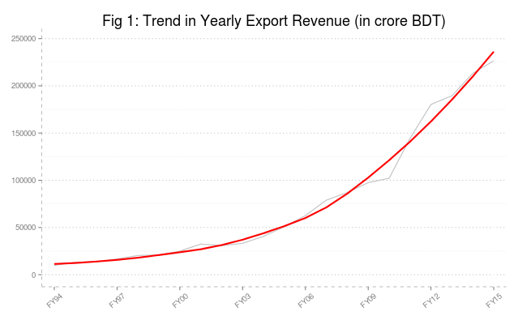
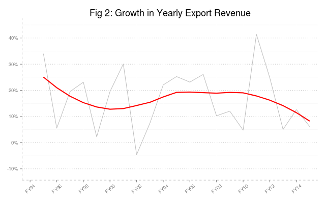
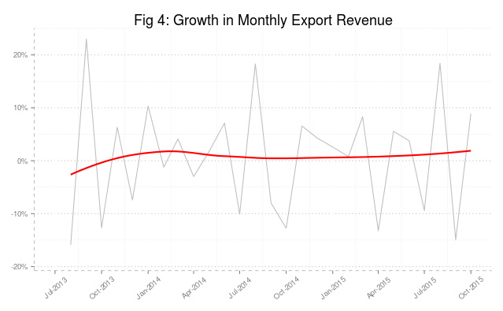

This is the first post in a series of articles where I am going to graphically explore the state of Bangldesh economy based on [latest data](https://www.bb.org.bd/pub/monthly/econtrds/statisticaltable.xls) available. These posts are no way rigorous in any manner, rather an exploration at a very basic level. 

 Let's start by looking into export scenario. In the following we plot yearly data of export revenue along with a smoothing line: 

We find  that  the exports are showing an exponentially increasing pattern since the beginning of millenium. On the other hand, Figure 2 reflects  the growth rate of this remarkable increase in export revenue. We find that growth of exports hover around 20 percent for the good part of the last twenty years. But in recent years, particularly since 2010, we observe a decline and particularly in 2015, the exports of Bangladesh could only register a 6 percent growth. 

The yearly data may mask some of other seasonal pattern which might be interesting. To that end, let's have a look into monthly data of export revenue for last couple of years.If we look into export trend, we see the following pattern:

Monthly exports show steady increase and monthly exports growth is stable at around 1 percent to 3 percent (Fig 4). 

We don't seem to find something quite striking in those monthly exports data apart from those spikes in the beginning of each fiscal year. 